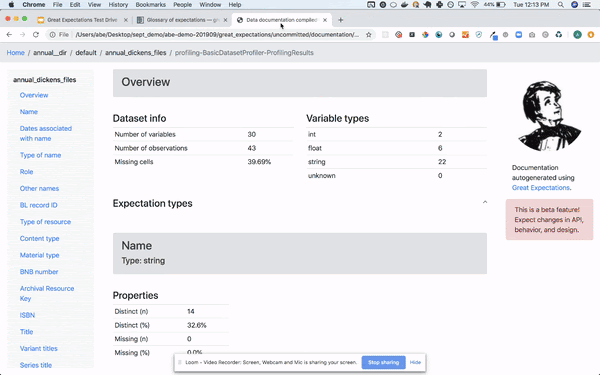
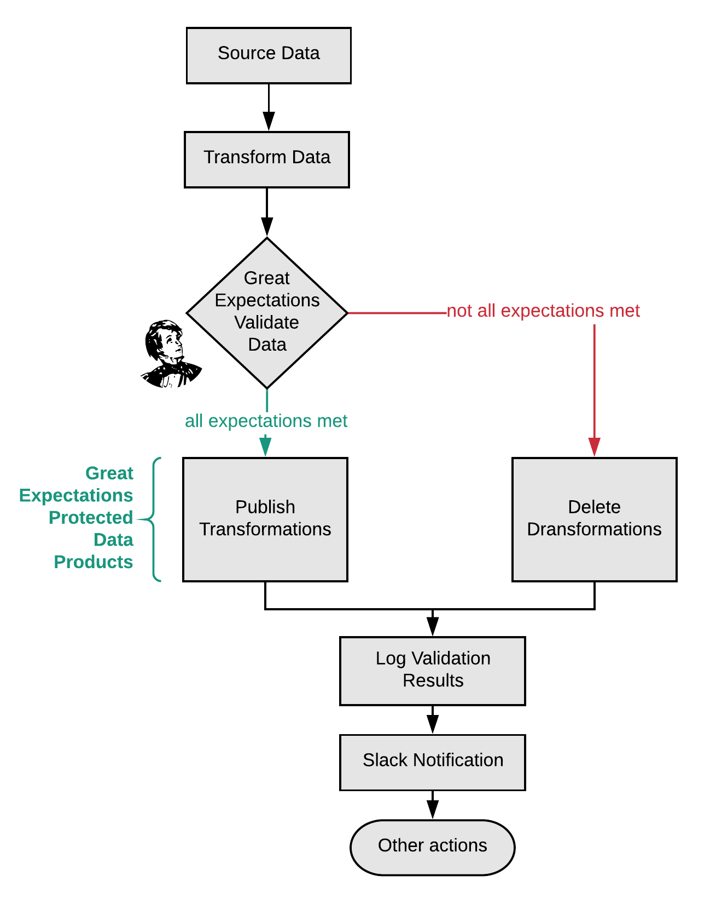

autoscale: true

# [fit] **_Crushing_**
# [fit] Pipeline Debt
## **_With_**
# [fit] **Great Expectations**

Taylor Miller @ Superconductive
http://tiny.cc/udem-ge

---

# 👋

I'm from Superconductive.com

We are data mercenaries for hire hell-bent on data quality.

---

# agenda

1. A thing we do that is absolutely crazy
2. How to crush pipeline debt
3. Live demo

---

Here's some software!
BTW it's...
# [fit] .
# [fit] .
# [fit] .

---

Here's some software!
BTW it's...

# [fit] **_Un_**documented
# [fit] .
# [fit] .

^ Figure it out yourself

---

Here's some software!
BTW it's...

# [fit] **_Un_**documented
# [fit] **_Un_**tested
# [fit] .

^ Yeah, we haven't had time to do that.

---

Here's some software!
BTW it's...

# [fit] **_Un_**documented
# [fit] **_Un_**tested
# [fit] **_Un_**stable

^ The APIs might change. And I won't be able to warn you.

---

Here's some ~~software~~ data!
BTW it's...

# [fit] .
# [fit] .
# [fit] .

^ I'm a Data Engineer. might be analytics, might be a warehouse, etc

---

Here's some ~~software~~ data!
BTW it's...

# [fit] **_Un_**documented
# [fit] .
# [fit] .

^ It's hard to keep those up to date - there might be an old data dictionary on the wiki somewhere

---

Here's some ~~software~~ data!
BTW it's...

# [fit] **_Un_**documented
# [fit] **_Un_**tested
# [fit] .

---

Here's some ~~software~~ data!
BTW it's...

# [fit] **_Un_**documented
# [fit] **_Un_**tested
# [fit] **_Un_**stable

^ Meaning may change. Fields may appear or disappear.

---

# Pipeline Debt

---

# [fit] Pipelines are like software.
## And also not.

|                       |     Software    |   Pipelines   |
|-----------------------|-----------------|---------------|
| _inputs are_          | usually known   | often unknown |
| _assumptions are_     | often crisp     | murky         |
| _failures created by_ | your code       | data creators |
| _tests verify_        | code            | data          |
| _tests run_           | at compile time | at run time   |
    
---

# But why test pipelines?

1. Risk mitigation
2. Pager mitigation
3. Increase trust & credibility
4. Codify knowledge & assumptions

---

# [fit] Pipeline Risks:

# [fit] missing / empty files **_mangled loads_**
# [fit] corrupted data
# [fit] **_schema changes_** outages
# [fit] unexpected values

---

# [fit] Data Risks:

#[fit] **_distribution drift_**
#[fit] model assumptions
#[fit] **_evolution_** edge cases
#[fit] bias **_outliers_**

---

# Question Time

---

# [fit] Great Expectations

# [fit] **_Always know what to expect from your data_**

^ open source python package
^ started in 2017

---

[.build-lists: true]

## Expectations are assertions about data

- `expect_file_size_to_be_between`
- `expect_table_row_count_to_be_between`
- `expect_column_to_exist`
- `expect_column_values_to_not_be_null`
- `expect_column_values_to_be_unique`
- `expect_column_values_to_be_between`
- `expect_column_values_to_be_in_set`
- `expect_column_values_to_match_regex`
- `expect_column_mean_to_be_between`
- `expect_column_kl_divergence_to_be_less_than`
- ... and many many more[^1]

[^1]: https://docs.greatexpectations.io/en/latest/expectation_glossary.html

^ declarative
almost 50 of them
you can create custom ones for your domain

---

# Where's does the compute happen?
### **_Great Expectations uses different back-end compute engines_**

- pandas
- Spark
- Common relational databases via SQLAlchemy
    + Redshift
    + BigQuery
    + Snowflake
    + Postgres
    + MySQL

^ Expectations are written in python and compiled to execute natively on the compute engine.

---

# [fit] Tests are docs
# [fit] **_and_**
# [fit] Docs are tests

^ lets look closer

---

# Tests are docs and docs are tests

- Everything is JSON 🤖
- Compile to HTML or Notebooks 🤗
- Docs cannot get stale!

^ expectations are JSON
validations are JSON
as long as you run tests you docs CANNOT get stale

---

# How to crush pipeline debt

[.column]
## _**data ingest**_
especially if the data isn't controlled your team

## _**before & after ML models**_
prevent malfeasant AI

[.column]
## _**analytic warehouses**_
Be good data driven.

## _**critical dashboard tables**_
Don't piss off an executive

^ Ok. Where do we start?

---

# How to use Great Expectations in a pipeline?

The WAP pattern![^2]

[^3]: Scaling Data Quality at Netflix https://www.slideshare.net/MichelleFUfford/scaling-data-quality-netflix-76917740

---

# How to use Great Expectations in a pipeline?

The WAP pattern![^2]

[^2]: Scaling Data Quality at Netflix https://www.slideshare.net/MichelleFUfford/scaling-data-quality-netflix-76917740

---

# Question Time

---

# [fit] live demo

^ 1. setup GE
2. Create an expectation suite
3. Edit that suite to hone it
4. deploy it

---

# Question Time

---

# Let's work together!

## Open Source
Slack: Questions, ideas, random data banter
GitHub: Feature requests, bugs, pull requests
Deploy-a-thons: Work with us to get set up in a 1/2 day

## Options where money changes hands:
Open source support contracts
Lighthouse partnerships

---

# Thank you!

Give us a look :eyes: greatexpectations.io

Give us a shout :mega: greatexpectations.io/slack

Give us a star :star: github.com/great-expectations/great_expectations

Give us a try :rocket: `pip install great_expectations`

---

# Misc

## Backstory

## Funding & Philosophy

We raised a round from CRV and Root Ventures late last year, so we have two full years of runway to work on Great Expectations.

At some point, we'll build a paid SaaS product on top of Great Expectations, but for now we're just making the open source project as useful as it can be.

We're firmly committed to keeping Great Expectations open: everything that is open source will always remain open source.