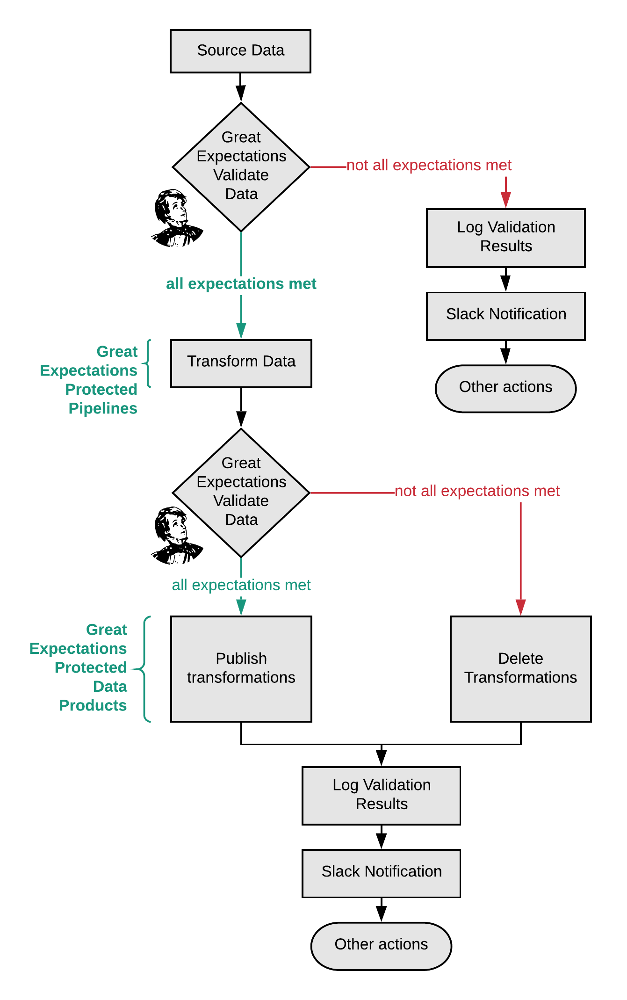

# Crushing
# Pipeline Debt
_With_
# **Great Expectations**

Taylor Miller @ Superconductive

---

# 👋

I'm from Superconductive.com
We are data mercenaries for hire hell-bent on data quality.

---

# agenda

1. A thing we do that is absolutely crazy
2. How to crush pipeline debt
3. Live demo

---

Here's some software!
BTW it's...

---

Here's some _software_!
BTW it's...

# [fit] **_Un_**documented
# [fit] .
# [fit] .

---

Here's some _software_!
BTW it's...

# [fit] **_Un_**documented
# [fit] **_Un_**tested
# [fit] .

---

Here's some _software_!
BTW it's...

# [fit] **_Un_**documented
# [fit] **_Un_**tested
# [fit] **_Un_**stable

---

Here's some ~~_software_~~ _data_!
BTW it's...

# [fit] **_Un_**documented
# [fit] .
# [fit] .

---

Here's some ~~_software_~~ _data_!
BTW it's...

# [fit] **_Un_**documented
# [fit] **_Un_**tested
# [fit] .

---

Here's some ~~_software_~~ _data_!
BTW it's...

# [fit] **_Un_**documented
# [fit] **_Un_**tested
# [fit] **_Un_**stable

---

# Pipelines are like software.
# And also not.

|                       |     Software    |   Pipelines   |
|-----------------------|-----------------|---------------|
| _inputs are_          | usually known   | often unknown |
| _assumptions are_     | often crisp     | murky         |
| _failures created by_ | your code       | data creators |
| _tests verify_        | code            | data          |
| _tests run_           | at compile time | at run time   |
    
---

# But why test pipelines?

1. Pager mitigation
2. Risk mitigation
3. Increase trust & credibility
4. Codify knowledge & assumptions

---

# What types of risk can we mitigate?

1. Pipeline risks
2. Data risks

---

# [fit] **_pipeline risks_**

# [fit] missing or empty files
# [fit] mangled loads
# [fit] outages
# [fit] corrupted data
# [fit] schema changes
# [fit] unexpected values

---

# [fit] Data Risks

#[fit] outliers
#[fit] distribution drift
#[fit] edge cases
#[fit] bias
#[fit] evolution
#[fit] outages
#[fit] model assumptions

---

# Great Expectations
## Always know what to expect from your data

# TODO logo

---

# Expectations are assertions about data 
# TODO examples

---

# Where's does the compute happen?
## Great Expectations uses different back-end compute engines
# TODO

---

# [fit] Tests are docs
# [fit] and
# [fit] Docs are tests

---

# Tests are docs and docs are tests

Everything is JSON :robot:
Compile to HTML or Notebooks
This means that docs cannot get stale!

---

# How to crush pipeline debt

- data ingest
    + especially if the data isn't controlled your team
- before & after ML models
    + prevent malfeasant AI
- critical dashboard tables
    + Don't piss off an executive
- analytic warehouses
    + Be good data driven.

---

# How to use Great Expectations in a pipeline?

The WAP pattern![^2]

[^2]: Netflix

---

# How to use Great Expectations in a pipeline?

The WAP pattern![^3]

[^3]: Netflix

---

# [fit] The era of
# [fit] pager duty fires is over.
# [fit] The protagonists **_get the value of GE_**
# [fit] integrated in their pipelines,
# [fit] Top Gun high five
# [fit] and enjoy their better work lives.

---

# [fit] live demo

---

Thank you!

Join us at greatexpectations.io

---

# Misc

## Backstory

## Funding & Philosophy

We raised a round from CRV and Root Ventures late last year, so we have two full years of runway to work on Great Expectations.

At some point, we'll build a paid SaaS product on top of Great Expectations, but for now we're just making the open source project as useful as it can be.

We're firmly committed to keeping Great Expectations open: everything that is open source will always remain open source.