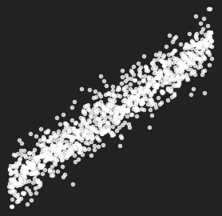
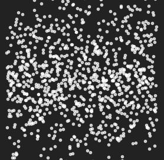

## Tactical Applied
# AI & ML
### Successes, Lessons Learned & Getting Started

---

# Who Am I

#### Taylor Miller PharmD
#### Data Scientist

<!--  -->
<svg width="70%" height="150px" xmlns:dc="http://purl.org/dc/elements/1.1/"xmlns:cc="http://creativecommons.org/ns#"xmlns:rdf="http://www.w3.org/1999/02/22-rdf-syntax-ns#"xmlns:svg="http://www.w3.org/2000/svg"xmlns="http://www.w3.org/2000/svg"id="svg94"version="1.1"viewBox="0 0 194.35 48.92"> <metadata id="metadata98"> <rdf:RDF> <cc:Work rdf:about=""> <dc:format>image/svg+xml</dc:format> <dc:type rdf:resource="http://purl.org/dc/dcmitype/StillImage" /> <dc:title>Logo-Full</dc:title> </cc:Work> </rdf:RDF> </metadata> <defs id="defs4">  </defs> <title id="title6">Logo-Full</title> <path style="fill:#ffffff;fill-opacity:0.95238096"id="path8"d="M 15,48.92 A 12.88,12.88 0 0 1 10.94,45.7 15.45,15.45 0 0 1 8.2,40.93 17.28,17.28 0 0 1 7.2,35.08 C 7.2,22.8 17.4,16.14 16.31,3.72 A 6.07,6.07 0 0 0 15.96,1.72 5.41,5.41 0 0 0 15,0 12.91,12.91 0 0 1 19,3.22 15.45,15.45 0 0 1 21.77,8 a 17.31,17.31 0 0 1 1,5.85 c 0,10.62 -9.67,18.41 -9.67,29.77 a 8.62,8.62 0 0 0 0.5,2.92 7.73,7.73 0 0 0 1.4,2.38"class="cls-1" /> <polygon style="fill:#ffffff;fill-opacity:0.95238096"id="polygon10"points="37.31,31.08 37.31,13.63 40.36,13.63 40.36,20.93 47.51,20.93 47.51,13.63 50.57,13.63 50.57,31.08 47.51,31.08 47.51,23.39 40.36,23.39 40.36,31.08 "class="cls-1" /> <path style="fill:#ffffff;fill-opacity:0.95238096"id="path12"d="M 55.18,25.83 C 55.33,28.4 56.67,29 58.74,29 a 38.05,38.05 0 0 0 4.79,-0.34 l 0.24,2.12 a 33.57,33.57 0 0 1 -5.76,0.49 c -4.47,0 -5.65,-2.9 -5.65,-6.86 0,-4.84 1.5,-6.85 5.94,-6.85 4.8,0 5.83,2.53 5.83,6.51 0,0.32 0,0.65 0,1 -1.53,0.27 -4.71,0.58 -6.56,0.67 z m 2.61,-2.07 c 1,0 2.53,-0.17 3.45,-0.3 a 5.79,5.79 0 0 0 0,-0.62 c 0,-2 -0.75,-3.14 -3,-3.14 -2.81,0 -3.19,1.78 -3.19,4.19 z"class="cls-1" /> <path style="fill:#ffffff;fill-opacity:0.95238096"id="path14"d="m 65.56,27.11 c 0,-2.33 1,-3.79 3.59,-4.18 a 44.13,44.13 0 0 1 4.73,-0.35 c 0,-1.85 -0.81,-2.78 -2.84,-2.78 A 38.22,38.22 0 0 0 66.4,20.14 L 66.17,18 a 30.84,30.84 0 0 1 5.14,-0.49 c 2.94,0 5.36,0.8 5.36,4.2 v 5.88 c 0,0.88 0,1.64 -0.11,2.45 a 12.19,12.19 0 0 1 -6,1.17 c -3.61,0 -5,-1.42 -5,-4.16 m 8.32,-2.67 a 20.36,20.36 0 0 0 -3.63,0.32 c -1.39,0.32 -1.88,0.75 -1.88,2.31 0,1.56 0.93,2.08 2.64,2.08 a 6.91,6.91 0 0 0 2.79,-0.46 17.24,17.24 0 0 0 0.08,-1.79 z"class="cls-1" /> <path style="fill:#ffffff;fill-opacity:0.95238096"id="path16"d="m 79,12.59 h 2.85 V 27.5 a 4.51,4.51 0 0 0 1,3 l -2.48,1.18 a 5.67,5.67 0 0 1 -1.35,-4 z"class="cls-1" /> <path style="fill:#ffffff;fill-opacity:0.95238096"id="path18"d="m 92,31.07 a 13.13,13.13 0 0 1 -2,0.2 c -2.7,0 -3.85,-1.18 -3.85,-3.64 v -7.78 h -2.31 v -2.11 h 2.26 v -3.3 L 89,14 v 3.77 h 2.77 v 2.11 H 89 v 7.53 c 0,1.29 0.55,1.69 1.78,1.69 0.34,0 0.67,0 1,0 z"class="cls-1" /> <path style="fill:#ffffff;fill-opacity:0.95238096"id="path20"d="m 105.38,31.08 h -2.85 v -8.21 c 0,-2.13 -0.39,-3 -3.14,-3 a 6.42,6.42 0 0 0 -2.52,0.52 V 31.08 H 94 V 12.59 h 2.85 v 5.48 a 10.91,10.91 0 0 1 3.3,-0.5 c 4.71,0 5.21,2.19 5.21,5 z"class="cls-1" /> <path style="fill:#ffffff;fill-opacity:0.95238096"id="path22"d="m 119.7,16.24 a 22,22 0 0 0 -3.43,-0.28 c -4.69,0 -4.73,2.71 -4.73,6.4 0,3.69 0,6.4 4.73,6.4 a 22,22 0 0 0 3.43,-0.28 l 0.27,2.31 a 18.84,18.84 0 0 1 -4.38,0.48 c -5.75,0 -7.16,-2.71 -7.16,-8.91 0,-6.2 1.42,-8.91 7.16,-8.91 a 18.84,18.84 0 0 1 4.38,0.48 z"class="cls-1" /> <path style="fill:#ffffff;fill-opacity:0.95238096"id="path24"d="m 121.77,27.11 c 0,-2.33 1,-3.79 3.59,-4.18 a 44.15,44.15 0 0 1 4.73,-0.35 c 0,-1.85 -0.81,-2.78 -2.84,-2.78 a 38.22,38.22 0 0 0 -4.64,0.34 L 122.38,18 a 30.84,30.84 0 0 1 5.14,-0.49 c 2.94,0 5.36,0.8 5.36,4.2 v 5.88 c 0,0.88 0,1.64 -0.11,2.45 a 12.19,12.19 0 0 1 -6,1.17 c -3.61,0 -5,-1.42 -5,-4.16 m 8.32,-2.67 a 20.35,20.35 0 0 0 -3.63,0.32 c -1.39,0.32 -1.88,0.75 -1.88,2.31 0,1.56 0.93,2.08 2.64,2.08 a 6.91,6.91 0 0 0 2.79,-0.46 17.4,17.4 0 0 0 0.08,-1.79 z"class="cls-1" /> <path style="fill:#ffffff;fill-opacity:0.95238096"id="path26"d="m 142.39,31.07 a 13.14,13.14 0 0 1 -2,0.2 c -2.71,0 -3.85,-1.18 -3.85,-3.64 v -7.78 h -2.25 v -2.11 h 2.25 v -3.3 l 2.86,-0.46 v 3.77 h 2.77 v 2.11 h -2.77 v 7.53 c 0,1.29 0.55,1.69 1.78,1.69 0.34,0 0.67,0 1,0 z"class="cls-1" /> <path style="fill:#ffffff;fill-opacity:0.95238096"id="path28"d="m 144.41,27.11 c 0,-2.33 1,-3.79 3.59,-4.18 a 44.13,44.13 0 0 1 4.73,-0.35 c 0,-1.85 -0.81,-2.78 -2.84,-2.78 a 38.25,38.25 0 0 0 -4.64,0.34 L 145,18 a 30.85,30.85 0 0 1 5.14,-0.49 c 2.94,0 5.36,0.8 5.36,4.2 v 5.88 c 0,0.88 0,1.64 -0.11,2.45 a 12.2,12.2 0 0 1 -6,1.17 c -3.61,0 -5,-1.42 -5,-4.16 m 8.32,-2.67 a 20.36,20.36 0 0 0 -3.63,0.32 c -1.39,0.32 -1.88,0.75 -1.88,2.31 0,1.56 0.93,2.08 2.64,2.08 a 6.9,6.9 0 0 0 2.79,-0.46 17.08,17.08 0 0 0 0.08,-1.79 z"class="cls-1" /> <path style="fill:#ffffff;fill-opacity:0.95238096"id="path30"d="m 157.33,12.59 h 2.86 V 27.5 a 4.51,4.51 0 0 0 1,3 l -2.48,1.18 a 5.67,5.67 0 0 1 -1.35,-4 z"class="cls-1" /> <polygon style="fill:#ffffff;fill-opacity:0.95238096"id="polygon32"points="165.48,36 167.54,30.19 162.16,17.74 165.17,17.74 168.83,26.66 171.69,17.74 174.57,17.74 168.36,36 "class="cls-1" /> <path style="fill:#ffffff;fill-opacity:0.95238096"id="path34"d="m 181.75,27.44 c 0,-1.53 -1.37,-1.66 -2.61,-2 C 177,24.75 175,24.2 175,21.33 c 0,-2.87 2.06,-3.77 4.7,-3.77 a 19.8,19.8 0 0 1 4.74,0.52 l -0.27,2.09 a 18,18 0 0 0 -3.33,-0.36 c -1.08,0 -3,0 -3,1.36 0,1.36 1.62,1.65 2.73,2 2.28,0.77 4.12,1.2 4.12,4.13 0,2.93 -2.28,3.93 -5.2,3.93 a 20.69,20.69 0 0 1 -4.61,-0.52 l 0.27,-2.13 a 22.55,22.55 0 0 0 3.55,0.37 c 1.06,0 3.09,0 3.09,-1.54"class="cls-1" /> <path style="fill:#ffffff;fill-opacity:0.95238096"id="path36"d="m 194.35,31.07 a 13.12,13.12 0 0 1 -2,0.2 c -2.7,0 -3.85,-1.18 -3.85,-3.64 v -7.78 h -2.25 v -2.11 h 2.25 v -3.3 l 2.85,-0.46 v 3.77 h 2.77 v 2.11 h -2.77 v 7.53 c 0,1.29 0.55,1.69 1.78,1.69 0.34,0 0.67,0 1,0 z"class="cls-1" /> <path style="fill:#ffffff;fill-opacity:0.95238096"id="path38"d="M 24.16,48.25 A 8.67,8.67 0 0 1 21.44,46.09 10.32,10.32 0 0 1 19.61,42.89 11.59,11.59 0 0 1 18.94,39 c 0,-8.23 7.54,-12.87 6.39,-23.49 a 15.82,15.82 0 0 1 3.38,5.35 11.58,11.58 0 0 1 0.67,3.91 c 0,7.11 -6.47,12.33 -6.47,19.94 a 5.77,5.77 0 0 0 0.34,2 5.15,5.15 0 0 0 0.92,1.6"class="cls-1" /> <path style="fill:#ffffff;fill-opacity:0.95238096"id="path40"d="M 5.22,34.29 A 8.66,8.66 0 0 1 2.5,32.13 10.33,10.33 0 0 1 0.67,28.93 11.58,11.58 0 0 1 0,25 C 0,16.79 7.55,12.15 6.39,1.53 a 15.81,15.81 0 0 1 3.38,5.35 11.55,11.55 0 0 1 0.67,3.91 C 10.44,17.91 4,23.12 4,30.73 a 5.81,5.81 0 0 0 0.34,2 5.17,5.17 0 0 0 0.92,1.6"class="cls-1" /> <path style="fill:#ffffff;fill-opacity:0.95238096"id="path42"d="m 37.26,36.33 c 0,-0.33 0.08,-0.45 0.37,-0.45 0.29,0 0.37,0.12 0.37,0.45 0,0.33 -0.08,0.45 -0.37,0.45 -0.29,0 -0.37,-0.11 -0.37,-0.45 m 0.06,1.35 h 0.61 v 4.52 h -0.61 z"class="cls-1" /> <path style="fill:#ffffff;fill-opacity:0.95238096"id="path44"d="M 39.43,43.27 A 10.35,10.35 0 0 0 41,43.4 c 1,0 1.23,-0.3 1.23,-1 V 42 a 4.94,4.94 0 0 1 -1.25,0.17 c -1.34,0 -1.89,-0.56 -1.89,-2.26 0,-1.7 0.61,-2.27 2,-2.27 A 3.75,3.75 0 0 1 42.78,38 c 0,0.25 0,0.51 0,0.77 v 3.79 c 0,1.12 -0.76,1.37 -1.72,1.37 a 10.35,10.35 0 0 1 -1.71,-0.16 z m 0.24,-3.37 c 0,1.24 0.23,1.75 1.47,1.75 a 3.59,3.59 0 0 0 1.05,-0.18 V 39 c 0,-0.21 0,-0.49 0,-0.71 a 2.85,2.85 0 0 0 -1.09,-0.2 c -1.11,0 -1.41,0.58 -1.41,1.76"class="cls-1" /> <path style="fill:#ffffff;fill-opacity:0.95238096"id="path46"d="m 44.75,42.2 h -0.61 v -3.43 c 0,-0.26 0,-0.52 0,-0.77 a 5.23,5.23 0 0 1 2,-0.38 c 1.54,0 1.69,0.73 1.69,1.64 v 2.94 h -0.62 v -2.82 c 0,-0.85 -0.15,-1.24 -1.28,-1.24 a 3.66,3.66 0 0 0 -1.22,0.22 c 0,0.21 0,0.49 0,0.71 z"class="cls-1" /> <path style="fill:#ffffff;fill-opacity:0.95238096"id="path48"d="m 49.12,36.33 c 0,-0.33 0.08,-0.45 0.37,-0.45 0.29,0 0.37,0.12 0.37,0.45 0,0.33 -0.08,0.45 -0.37,0.45 -0.29,0 -0.37,-0.11 -0.37,-0.45 m 0.06,1.35 h 0.62 v 4.52 h -0.62 z"class="cls-1" /> <path style="fill:#ffffff;fill-opacity:0.95238096"id="path50"d="m 52.17,36.41 v 1.27 h 1 v 0.49 h -1 V 41 c 0,0.64 0.22,0.76 0.77,0.76 h 0.25 l 0.05,0.47 a 3.17,3.17 0 0 1 -0.49,0 c -0.83,0 -1.19,-0.36 -1.19,-1.18 v -2.9 h -0.83 v -0.49 h 0.83 v -1.15 z"class="cls-1" /> <path style="fill:#ffffff;fill-opacity:0.95238096"id="path52"d="m 53.92,39.94 c 0,-1.64 0.49,-2.31 2,-2.31 1.51,0 1.94,0.8 1.94,2 0,0.13 0,0.29 0,0.43 -0.52,0.09 -1.59,0.19 -2.22,0.21 h -1.07 c 0.08,0.92 0.35,1.4 1.49,1.4 a 11.64,11.64 0 0 0 1.59,-0.13 l 0.06,0.5 a 11.23,11.23 0 0 1 -1.89,0.15 c -1.48,0 -1.87,-1 -1.87,-2.32 m 1.79,-0.12 c 0.4,0 1.07,-0.07 1.49,-0.12 0,-0.09 0,-0.22 0,-0.32 0,-0.76 -0.33,-1.25 -1.32,-1.25 -0.99,0 -1.37,0.58 -1.37,1.75 z"class="cls-1" /> <path style="fill:#ffffff;fill-opacity:0.95238096"id="path54"d="m 61.24,39.94 c 0,-1.69 0.53,-2.31 2,-2.31 1.47,0 2,0.65 2,2.31 0,1.66 -0.52,2.32 -2,2.32 -1.48,0 -2,-0.63 -2,-2.32 m 3.34,0 c 0,-1.37 -0.32,-1.79 -1.36,-1.79 -1.04,0 -1.36,0.36 -1.36,1.79 0,1.43 0.34,1.8 1.36,1.8 1.02,0 1.36,-0.43 1.36,-1.8"class="cls-1" /> <path style="fill:#ffffff;fill-opacity:0.95238096"id="path56"d="M 66.37,37.69 H 67 v 2.81 c 0,0.85 0.15,1.24 1.28,1.24 a 3.61,3.61 0 0 0 1.21,-0.22 c 0,-0.21 0,-0.49 0,-0.71 v -3.12 h 0.61 v 3.42 c 0,0.26 0,0.52 0,0.77 a 5.19,5.19 0 0 1 -2,0.38 c -1.53,0 -1.69,-0.73 -1.69,-1.64 z"class="cls-1" /> <path style="fill:#ffffff;fill-opacity:0.95238096"id="path58"d="m 72.52,36.41 v 1.27 h 1 v 0.49 h -1 V 41 c 0,0.64 0.22,0.76 0.77,0.76 h 0.25 v 0.47 a 3.15,3.15 0 0 1 -0.49,0 c -0.83,0 -1.19,-0.36 -1.19,-1.18 v -2.9 h -0.83 v -0.49 h 0.83 v -1.15 z"class="cls-1" /> <path style="fill:#ffffff;fill-opacity:0.95238096"id="path60"d="m 77.28,42.12 a 5.54,5.54 0 0 1 -1.18,0.13 c -1.52,0 -1.8,-1.07 -1.8,-2.36 0,-1.48 0.33,-2.27 2,-2.27 a 3.81,3.81 0 0 1 1,0.13 l -0.05,0.47 A 4.79,4.79 0 0 0 76.5,38.14 c -1.41,0 -1.55,0.49 -1.55,1.74 0,1.25 0.1,1.83 1.54,1.83 a 4.2,4.2 0 0 0 0.76,-0.1 z"class="cls-1" /> <path style="fill:#ffffff;fill-opacity:0.95238096"id="path62"d="m 78,39.94 c 0,-1.69 0.53,-2.31 2,-2.31 1.47,0 2,0.65 2,2.31 0,1.66 -0.52,2.32 -2,2.32 -1.48,0 -2,-0.63 -2,-2.32 m 3.34,0 c 0,-1.37 -0.32,-1.79 -1.36,-1.79 -1.04,0 -1.36,0.36 -1.36,1.79 0,1.43 0.34,1.8 1.36,1.8 1.02,0 1.36,-0.43 1.36,-1.8"class="cls-1" /> <path style="fill:#ffffff;fill-opacity:0.95238096"id="path64"d="m 83.8,42.2 h -0.61 v -3.43 c 0,-0.26 0,-0.52 0,-0.77 a 5.15,5.15 0 0 1 1.85,-0.38 1.58,1.58 0 0 1 1.17,0.36 3.86,3.86 0 0 1 1.66,-0.36 c 1.35,0 1.55,0.75 1.55,1.64 v 2.94 h -0.61 v -2.82 c 0,-0.86 -0.21,-1.23 -1.13,-1.23 a 2.71,2.71 0 0 0 -1.18,0.3 2.56,2.56 0 0 1 0.11,0.82 V 42.2 H 86 v -2.82 c 0,-0.86 -0.21,-1.23 -1.13,-1.23 a 3.18,3.18 0 0 0 -1.06,0.22 c 0,0.21 0,0.49 0,0.71 z"class="cls-1" /> <path style="fill:#ffffff;fill-opacity:0.95238096"id="path66"d="m 90.64,39.94 c 0,-1.64 0.49,-2.31 2,-2.31 1.51,0 1.94,0.8 1.94,2 0,0.13 0,0.29 0,0.43 -0.52,0.09 -1.59,0.19 -2.22,0.21 h -1.07 c 0.08,0.92 0.35,1.4 1.49,1.4 a 11.64,11.64 0 0 0 1.59,-0.13 l 0.06,0.5 a 11.23,11.23 0 0 1 -1.89,0.15 c -1.48,0 -1.87,-1 -1.87,-2.32 m 1.79,-0.12 c 0.4,0 1.07,-0.07 1.49,-0.12 0,-0.09 0,-0.22 0,-0.32 0,-0.76 -0.33,-1.25 -1.32,-1.25 -0.99,0 -1.37,0.58 -1.37,1.75 z"class="cls-1" /> <path style="fill:#ffffff;fill-opacity:0.95238096"id="path68"d="m 96.14,38.77 c 0,0.6 0.46,0.67 1.11,0.87 0.91,0.28 1.42,0.51 1.42,1.34 0,1 -0.74,1.27 -1.72,1.27 A 6.69,6.69 0 0 1 95.52,42.1 l 0.06,-0.48 a 7.46,7.46 0 0 0 1.16,0.11 c 0.53,0 1.31,0 1.31,-0.71 0,-0.71 -0.4,-0.67 -1.1,-0.88 -0.7,-0.21 -1.41,-0.38 -1.41,-1.31 0,-0.93 0.65,-1.21 1.56,-1.21 a 6.81,6.81 0 0 1 1.47,0.15 l -0.06,0.48 a 6.56,6.56 0 0 0 -1.13,-0.11 c -0.52,0 -1.22,0 -1.22,0.63"class="cls-1" /> <path style="fill:#ffffff;fill-opacity:0.95238096"id="path70"d="m 102,36.33 c 0,-0.33 0.08,-0.45 0.37,-0.45 0.29,0 0.37,0.12 0.37,0.45 0,0.33 -0.08,0.45 -0.37,0.45 -0.29,0 -0.37,-0.11 -0.37,-0.45 m 0.06,1.35 h 0.62 v 4.52 h -0.62 z"class="cls-1" /> <path style="fill:#ffffff;fill-opacity:0.95238096"id="path72"d="M 104.62,42.2 H 104 v -3.43 c 0,-0.26 0,-0.52 0,-0.77 a 5.15,5.15 0 0 1 1.85,-0.38 1.58,1.58 0 0 1 1.17,0.36 3.85,3.85 0 0 1 1.66,-0.36 c 1.35,0 1.55,0.75 1.55,1.64 v 2.94 h -0.61 v -2.82 c 0,-0.86 -0.21,-1.23 -1.13,-1.23 a 2.71,2.71 0 0 0 -1.18,0.3 2.57,2.57 0 0 1 0.11,0.82 v 2.93 h -0.61 v -2.82 c 0,-0.86 -0.21,-1.23 -1.13,-1.23 a 3.17,3.17 0 0 0 -1.06,0.22 c 0,0.21 0,0.49 0,0.71 z"class="cls-1" /> <path style="fill:#ffffff;fill-opacity:0.95238096"id="path74"d="m 112.22,43.86 h -0.61 v -5.1 c 0,-0.26 0,-0.52 0,-0.77 a 3.76,3.76 0 0 1 1.69,-0.36 c 1.43,0 2,0.56 2,2.32 0,1.76 -0.55,2.31 -1.89,2.31 a 5,5 0 0 1 -1.25,-0.17 z m 1.05,-2.11 c 1.25,0 1.47,-0.54 1.47,-1.8 0,-1.26 -0.3,-1.81 -1.42,-1.81 a 2.85,2.85 0 0 0 -1.09,0.2 c 0,0.22 0,0.5 0,0.71 v 2.52 a 3.61,3.61 0 0 0 1.05,0.18"class="cls-1" /> <path style="fill:#ffffff;fill-opacity:0.95238096"id="path76"d="m 116.52,42.2 v -3.44 c 0,-0.26 0,-0.52 0,-0.77 a 3.75,3.75 0 0 1 1.69,-0.36 h 0.42 l -0.05,0.52 h -0.37 a 2.85,2.85 0 0 0 -1.09,0.21 c 0,0.21 0,0.5 0,0.71 v 3.13 z"class="cls-1" /> <path style="fill:#ffffff;fill-opacity:0.95238096"id="path78"d="m 119.32,39.94 c 0,-1.69 0.53,-2.31 2,-2.31 1.47,0 2,0.65 2,2.31 0,1.66 -0.52,2.32 -2,2.32 -1.48,0 -2,-0.63 -2,-2.32 m 3.34,0 c 0,-1.37 -0.32,-1.79 -1.36,-1.79 -1.04,0 -1.36,0.36 -1.36,1.79 0,1.43 0.34,1.8 1.36,1.8 1.02,0 1.36,-0.43 1.36,-1.8"class="cls-1" /> <path style="fill:#ffffff;fill-opacity:0.95238096"id="path80"d="m 126.53,41.82 c -0.11,0.29 -0.25,0.44 -0.48,0.44 -0.23,0 -0.39,-0.14 -0.5,-0.44 L 124,37.69 h 0.66 l 1.43,3.84 1.46,-3.84 h 0.63 z"class="cls-1" /> <path style="fill:#ffffff;fill-opacity:0.95238096"id="path82"d="m 128.82,39.94 c 0,-1.64 0.49,-2.31 2,-2.31 1.51,0 1.94,0.8 1.94,2 0,0.13 0,0.29 0,0.43 -0.52,0.09 -1.58,0.19 -2.22,0.21 h -1.07 c 0.08,0.92 0.35,1.4 1.49,1.4 a 11.63,11.63 0 0 0 1.59,-0.13 l 0.06,0.5 a 11.24,11.24 0 0 1 -1.89,0.15 c -1.48,0 -1.87,-1 -1.87,-2.32 m 1.79,-0.12 c 0.4,0 1.07,-0.07 1.49,-0.12 0,-0.09 0,-0.22 0,-0.32 0,-0.76 -0.33,-1.25 -1.32,-1.25 -0.99,0 -1.37,0.58 -1.37,1.75 z"class="cls-1" /> <path style="fill:#ffffff;fill-opacity:0.95238096"id="path84"d="m 134.47,42.2 h -0.61 v -3.43 c 0,-0.26 0,-0.52 0,-0.77 a 5.15,5.15 0 0 1 1.85,-0.38 1.58,1.58 0 0 1 1.17,0.36 3.85,3.85 0 0 1 1.66,-0.36 c 1.35,0 1.55,0.75 1.55,1.64 v 2.94 h -0.61 v -2.82 c 0,-0.86 -0.21,-1.23 -1.13,-1.23 a 2.71,2.71 0 0 0 -1.18,0.3 2.57,2.57 0 0 1 0.11,0.82 v 2.93 h -0.61 v -2.82 c 0,-0.86 -0.21,-1.23 -1.13,-1.23 a 3.17,3.17 0 0 0 -1.06,0.22 c 0,0.21 0,0.49 0,0.71 z"class="cls-1" /> <path style="fill:#ffffff;fill-opacity:0.95238096"id="path86"d="m 141.31,39.94 c 0,-1.64 0.49,-2.31 2,-2.31 1.51,0 1.94,0.8 1.94,2 0,0.13 0,0.29 0,0.43 -0.52,0.09 -1.58,0.19 -2.22,0.21 h -1.07 c 0.08,0.92 0.35,1.4 1.49,1.4 a 11.63,11.63 0 0 0 1.59,-0.13 l 0.06,0.5 a 11.24,11.24 0 0 1 -1.89,0.15 c -1.48,0 -1.87,-1 -1.87,-2.32 m 1.79,-0.12 c 0.4,0 1.07,-0.07 1.49,-0.12 0,-0.09 0,-0.22 0,-0.32 0,-0.76 -0.33,-1.25 -1.32,-1.25 -0.99,0 -1.37,0.58 -1.37,1.75 z"class="cls-1" /> <path style="fill:#ffffff;fill-opacity:0.95238096"id="path88"d="m 147,42.2 h -0.61 v -3.43 c 0,-0.26 0,-0.52 0,-0.77 a 5.23,5.23 0 0 1 2,-0.38 c 1.54,0 1.69,0.73 1.69,1.64 v 2.94 h -0.62 v -2.82 c 0,-0.85 -0.15,-1.24 -1.28,-1.24 a 3.67,3.67 0 0 0 -1.22,0.22 c 0,0.21 0,0.49 0,0.71 z"class="cls-1" /> <path style="fill:#ffffff;fill-opacity:0.95238096"id="path90"d="m 152.42,36.41 v 1.27 h 1 v 0.49 h -1 V 41 c 0,0.64 0.22,0.76 0.77,0.76 h 0.25 v 0.47 a 3.16,3.16 0 0 1 -0.49,0 c -0.83,0 -1.19,-0.36 -1.19,-1.18 v -2.9 H 151 v -0.49 h 0.82 v -1.15 z"class="cls-1" /> </svg>

github: @Aylr

---

# Who are you?

Note:
- how many work in healthcare?
- how many are analysts?
- clinicians?
- leaders?
- new to machine learning?

---

# What to expect

### Healthcare gap
### What is ML?
### Why ML?
### Successes
### Lessons Learned

---

## Where is AI/ML Used?

- Marketing & Finance: Amazon, PayPal
- Consumer Goods: Siri, Alexa, Google Home, Tesla
- Entertainment: Facebook, Netflix, YouTube, Spotify
- Travel: Airbnb, Kayak, Uber
- Industry: GE, Kuka
 
 
 

<h2>Everywhere</h2>

<h2>...except healthcare*</h2>

Note:
- GE **digital twin**

---

# What about _in_ healthcare?

Note:
- Lots of hype from Google, IBM, etc.

---

> We should stop training radiologists right now, in 5 years deep learning will have better performance.

#### Geoff Hinton

Note:
- one of the creators of deep learning
- While there may not be much ML/AI in healthcare now, there will be
- It will come faster than you realize.
- process
    1. A Bay area startup gets FDA approval.
    2. Their pricing will be orders of magnitude lower than humans.
    3. Payers will change reimbursement.
    4. Done.

---

<h1 style='margin-top: -2em'>A Brief History</h1>

<h2 class="fragment current-only history">1842 Ada Lovelace </h2>
<h2 class="fragment current-only history">1950 Alan Turing </h2>
<h2 class="fragment current-only history">1956 Marvin Minsky </h2>
<h2 class="fragment current-only history">1965-1980s Expert Systems</h2>
<h2 class="fragment current-only history">1986 Rina Dechter </h2>
<h2 class="fragment current-only history">2006 Andrew Ng </h2>

Note:
- Ada: the first computer programmer and recognized potential of a computing machine even though she never saw one work.
- Alan: General purpose computing. Father of CS
- Marvin: Coined the term AI. Foundational work for neural nets.
- Rina: CS PhD U of CA coined the term deep learning
- Andrew: Google researcher first commerical deep learning use

---

# Just What _is_ ML?

<h2 class="fragment">Automated</h2>
<h2 class="fragment">pattern finding</h2>
<h2 class="fragment">in highly dimensional</h2>
<h2 class="fragment"><i>usually</i> noisy data</h2>

---

# Wait, What?

<h2 class="fragment">Automated</h2>
<h2 class="fragment">pattern finding</h2>
<h2 class="fragment">in highly dimensional</h2>
<h2 class="fragment">noisy data</h2>

---

# ML In 5 Minutes

Note:
- Let's dig in a little deeper

---

# Signal vs Noise

 &nbsp;&nbsp;&nbsp;&nbsp;

---

# 2 Main Types

### Unsupervised

### Supervised

Note:

- No ground truth
- Known ground truth

---

# Ground Truth?

| Age | Height | Gender | BMI | A1c | Readmission |
| --- | ------ | ------ | --- | --- | ----------- |
| 33  |  152   |   F    |  18 | 5.6 |      N      |
| 66  |  168   |   M    |  21 | 8.9 |      Y      |
| ... |  ...   |   ...  | ... | ... |     ...     |
| 27  |  140   |   M    |  18 | 7.2 |      N      |
| 45  |  159   |   F    |  31 | 7.5 |      Y      |

Note:

- **Dimension** = **feature** = **field**
- **target** = ground truth

---

# Traning Data

## 80% train

## 20% Evaluate & validate

Note:

- This is where you'll hear algorithm names like
    + random forest
    + linear regression
    + lasso
    + neural nets
    + deep learning

---

# Wait!
## Do I need
# Big Data ?

<h2>Nope!</h2>

Note:
- Remember it all depends how strong the signals are in the noise.
- We've seen some models work well with only 100s of rows.
- We've seen lots of success with 10k-30k rows.

---

# But, Why ML?

Note:
- we've talked about
    + hype
    + how it works
- not the **why**

---

# LACE Score

### Risk of 30 day readmission or death

Note:
- study ran from 2004-2008 and published in 2010
- to tell this story, let's talk about readamissions
- this illustrates well how healthcare changes

---

# LACE

|     |                        |
| --- | ---------------------- |
| L   | Length of stay         |
| A   | Acute admission        |
| C   | Charleston comorbidity |
| E   | ER visits last 6 mo    |
|     |                        |

Note:
- Here's what's great about LACE
- Easy to calculate at discharge
- has had a large impact in quality of care

---

# LACE Gotchas

## 4812 patients in Ontario
## Only works at discharge

doi:  10.1503/cmaj.091117

Note:
- Raise your hands if your patient demographics == Ontario patients?
- How actionable is it at discharge?

---

# ML vs LACE

#### C-Statistic

<h2>LACE: 0.68&ast;</h2>

<h2>Best published ML: 0.78&ast;&ast;</h2>

<h2>Client ML Model: 0.84</h2>

&ast;doi: 10.1503/cmaj.091117 &ast;&ast;doi: 10.1142/9789813207813_0027

Note:
- C-stats measure the balance between True Positive & False Positive Rates
- 0.5 (coin flip) <--> 1.0 (perfect)
- Model (~13k training set)
    - This means better predictions,
    - less false positives & less false negatives
    - > 100 variables
    - insights delivered in workflow = **actionable**

---

# Success Stories

Note:
- We don't aim for sexy headlines
- in other words we aren't trying to cure cancer
- chipping away at pragmatic problems
- healtcare is rife with low hanging fruit

---

# Clinical

#### CLABSI Risk
#### Sepsis Risk
#### Heart Failure Readmission
#### COPD Readmission

Note:
- 50% CLABSI reduction large teaching hospital
- CLABSI & sepsis risks actionable and displayed in workflows

---

# Operational & Financial

#### Propensity to Pay
#### Service Line Verification
#### High Cost Imaging

Note:
1. optimize resource allocation & decrease uncompensated care:
    - determines who needs reminders, financial assistance
2. Annual savings > $1.2 mil validating chart reviews

---

# Population Health

#### No-shows
#### Care Management
#### Opioid Abuse Risk

Note:
- Client able to optimize scheduling for no show patients
- Early opioid risk work

---

# Lessons Learned

---

## Incorporating ML

1. Choose a problem
2. Organize a rich dataset
3. Develop & validate a model
4. Surface the insight
5. Be Agile

Note:
- This seems obvious in retrospect.
- Surface insight in the right workflow.
- Agile development methodologies are a game changer

---

# Key Players

### Domain Expert
### Analyst
### Data Scientist

Note:
- Magic happens when you pair a good analyst with a domain expert

---

# Technical Integration

## This is hard

Note:
- Technical integration is hard.
- Make sure your data platform supports ML

---

## Hard Lessons Learned

1. Predictions + actionable insight
2. Surface in workflows
3. Insights need context
4. Fail fast
5. Continually monitor
6. Interpretation is hard

Note:
1. Paired
2. key to adoption
3. context for informed decision
4. work with domain expert
5. lots of moving parts

---

<svg width="70%" height="150px" viewBox="0 0 331 44" version="1.1" xmlns="http://www.w3.org/2000/svg" xmlns:xlink="http://www.w3.org/1999/xlink"><g id="Page-1" stroke="none" stroke-width="1" fill="none" fill-rule="evenodd"><g id="healthcareAI-logo" fill-rule="nonzero"><g id="Group"><path d="M18.5,42.5 L18.5,24.2 C18.5,19.9 17.7,18.1 12.3,18.1 C10.6,18.1 8.9,18.4 7.5,19 L7.5,42.4 L0,42.4 L0,0.9 L7.5,0.9 L7.5,13 C9.5,12.4 11.7,12 14.2,12 C25,12 26.1,17.1 26.1,23.4 L26.1,42.4 L18.5,42.4 L18.5,42.5 Z" id="Shape" fill="#FFFFFF"></path> <path d="M32.1,27.5 C32.1,16.6 35.5,12.1 45.6,12.1 C56.5,12.1 58.8,17.8 58.8,26.9 C58.8,27.7 58.8,28.5 58.7,29.3 C55.3,29.9 48.6,30.6 44.5,30.8 L39.6,31.1 C39.9,35.8 42.4,36.9 46.7,36.9 C50.7,36.9 54.4,36.5 57.5,36.1 L58.1,41.7 C54.9,42.2 50.8,42.8 45,42.8 C34.8,42.9 32.1,36.4 32.1,27.5 Z M44.5,25.7 C46.5,25.6 49.5,25.3 51.2,25.1 C51.3,24.8 51.3,24.2 51.3,23.9 C51.3,20 49.8,17.8 45.6,17.8 C40.1,17.8 39.4,21.2 39.4,25.9 L44.5,25.7 Z" id="Shape" fill="#FFFFFF"></path> <path d="M63.9,33.3 C63.9,28 66.2,24.7 72.2,23.8 C75.3,23.3 78.5,23.2 81.8,23 C81.8,19.5 80.2,18 76.3,18 C72.7,18 68.7,18.4 65.7,18.8 L65.1,13.2 C68.3,12.7 72.5,12.1 76.9,12.1 C83.6,12.1 89.1,14 89.1,21.8 L89.1,34.5 C89.1,36.5 89,38.3 88.8,40.2 C85.3,42.2 80.8,43 75.4,43 C67.1,42.9 63.9,39.7 63.9,33.3 Z M81.8,27.9 C79.6,28 77,28.1 74.9,28.6 C72.3,29.2 71.3,30.1 71.3,33.2 C71.3,36.4 73.1,37.2 76.4,37.2 C78.1,37.2 80.1,37.1 81.7,36.4 C81.8,35.2 81.9,33.7 81.9,32.4 L81.9,27.9 L81.8,27.9 Z" id="Shape" fill="#FFFFFF"></path> <path d="M96,0.9 L103.5,0.9 L103.5,34.3 C103.5,37 104.1,38.8 105.6,40.9 L99,44 C97.1,41.8 96,39.1 96,34.9 L96,0.9 Z" id="Shape" fill="#FFFFFF"></path> <path d="M121.3,4 L121.3,12.5 L127.3,12.5 L127.3,18.2 L121.3,18.2 L121.3,33.7 C121.3,36.2 122.3,37.2 124.9,37.2 C125.7,37.2 126.6,37.2 127.4,37.1 L128,42.4 C126.4,42.7 124.5,42.9 122.9,42.9 C116.6,42.9 113.9,40.1 113.9,34.4 L113.9,18.2 L109,18.2 L109,12.5 L113.9,12.5 L113.9,5.2 L121.3,4 Z" id="Shape" fill="#FFFFFF"></path> <path d="M151.9,42.5 L151.9,24.2 C151.9,19.9 151.1,18.1 145.7,18.1 C144,18.1 142.3,18.4 140.9,19 L140.9,42.4 L133.4,42.4 L133.4,0.9 L140.9,0.9 L140.9,13 C142.9,12.4 145.1,12 147.6,12 C158.4,12 159.5,17.1 159.5,23.4 L159.5,42.4 L151.9,42.4 L151.9,42.5 Z" id="Shape" fill="#FFFFFF"></path> <path d="M187.1,41.8 C184.5,42.5 181.3,42.9 177.3,42.9 C167.2,42.9 165.7,35.3 165.7,27.2 C165.7,17.4 168,12.1 179,12.1 C182.4,12.1 184.9,12.6 187,13.2 L186.4,18.7 C184.6,18.3 182.8,18 181,18 C174,18 173.2,20.1 173.2,27.2 C173.2,33.9 173.5,36.8 181,36.8 C182.8,36.8 184.5,36.5 186.4,36.1 L187.1,41.8 Z" id="Shape" fill="#FFFFFF"></path> <path d="M191.8,33.3 C191.8,28 194.1,24.7 200.1,23.8 C203.2,23.3 206.4,23.2 209.7,23 C209.7,19.5 208.1,18 204.2,18 C200.6,18 196.6,18.4 193.6,18.8 L193,13.2 C196.1,12.7 200.4,12.1 204.8,12.1 C211.5,12.1 217,14 217,21.8 L217,34.5 C217,36.5 216.9,38.3 216.7,40.2 C213.2,42.2 208.7,43 203.3,43 C195.1,42.9 191.8,39.7 191.8,33.3 Z M209.8,27.9 C207.6,28 205,28.1 202.9,28.6 C200.3,29.2 199.3,30.1 199.3,33.2 C199.3,36.4 201.1,37.2 204.4,37.2 C206.1,37.2 208.1,37.1 209.7,36.4 C209.8,35.2 209.9,33.7 209.9,32.4 L209.9,27.9 L209.8,27.9 Z" id="Shape" fill="#FFFFFF"></path> <path d="M224.4,42.5 L224.4,20.6 C224.4,18.6 224.5,16.8 224.7,14.9 C228.1,12.9 232.7,12.1 236.8,12.1 C237.9,12.1 238.9,12.2 239.8,12.3 L239.2,18.3 C238.6,18.2 237.8,18.2 237,18.2 C235.2,18.2 233.2,18.5 232,19.1 C231.9,20.3 231.8,21.8 231.8,23.1 L231.8,42.5 L224.4,42.5 Z" id="Shape" fill="#FFFFFF"></path> <path d="M243.5,27.5 C243.5,16.6 246.9,12.1 257,12.1 C268,12.1 270.2,17.8 270.2,26.9 C270.2,27.7 270.2,28.5 270.1,29.3 C266.7,29.9 260,30.6 255.9,30.8 L251,31.1 C251.3,35.8 253.8,36.9 258.1,36.9 C262.1,36.9 265.8,36.5 268.9,36.1 L269.5,41.7 C266.3,42.2 262.2,42.8 256.4,42.8 C246.2,42.9 243.5,36.4 243.5,27.5 Z M255.9,25.7 C257.9,25.6 260.9,25.3 262.6,25.1 C262.7,24.8 262.7,24.2 262.7,23.9 C262.7,20 261.2,17.8 257,17.8 C251.5,17.8 250.8,21.2 250.8,25.9 L255.9,25.7 Z" id="Shape" fill="#FFFFFF"></path> <path d="M275.7,38.6 C275.7,35.3 276.7,34.3 280.1,34.3 C283.5,34.3 284.5,35.3 284.5,38.6 C284.5,41.9 283.5,42.9 280.1,42.9 C276.7,42.9 275.7,41.8 275.7,38.6 Z" id="Shape" fill="#2AACE2"></path> <path d="M290.1,33.3 C290.1,28 292.4,24.7 298.4,23.8 C301.5,23.3 304.7,23.2 308,23 C308,19.5 306.4,18 302.5,18 C298.9,18 294.9,18.4 291.9,18.8 L291.3,13.2 C294.5,12.7 298.7,12.1 303.1,12.1 C309.8,12.1 315.3,14 315.3,21.8 L315.3,34.5 C315.3,36.5 315.2,38.3 315,40.2 C311.5,42.2 307,43 301.6,43 C293.4,42.9 290.1,39.7 290.1,33.3 Z M308,27.9 C305.8,28 303.2,28.1 301.1,28.6 C298.5,29.2 297.5,30.1 297.5,33.2 C297.5,36.4 299.3,37.2 302.6,37.2 C304.3,37.2 306.3,37.1 307.9,36.4 C308,35.2 308.1,33.7 308.1,32.4 L308.1,27.9 L308,27.9 Z" id="Shape" fill="#2AACE2"></path> <path d="M322,4.7 C322,1.6 323.1,0.5 326.4,0.5 C329.7,0.5 330.8,1.6 330.8,4.7 C330.8,7.8 329.8,8.9 326.4,8.9 C323,9 322,7.9 322,4.7 Z M322.7,12.5 L330.2,12.5 L330.2,42.5 L322.7,42.5 L322.7,12.5 Z" id="Shape" fill="#2AACE2"></path></g></g></g></svg>
 

    <h2>100% Open source</h2>
    <h2>Python &amp; R</h2>
    <h2>Simplify &amp; Expedite ML Adoption</h2>

    
    
    
    
    

Note:
- Feature Engineering
- Model Development
- Model Deployment
- Extras

---

# Resources

- http://healthcare.ai
- http://bit.ly/healthimpactmidwest
- taylor.miller@healthcatalyst.com

Note:
- ML Basics, Tutorials, Lessons Learned
- Open Source Tools
- Slack channel for realitime discussions