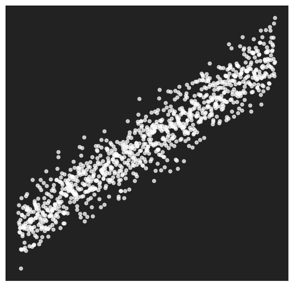
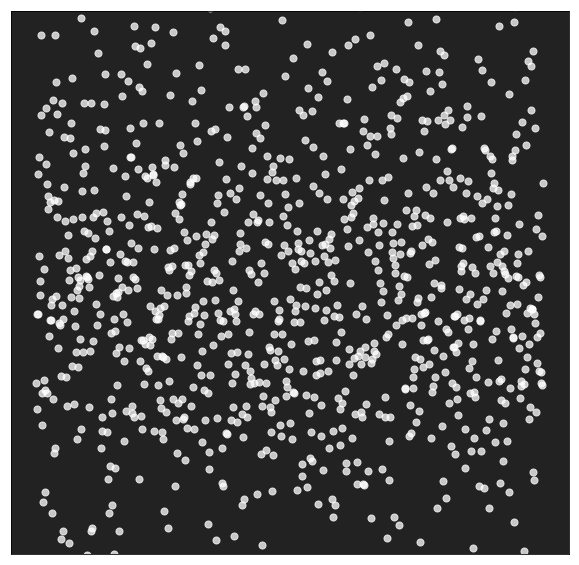

## Tactical Applied
# AI & ML
### Successes, Lessons Learned & Getting Started

---

# Who Am I

#### Taylor Miller PharmD

github: @Aylr

---

# Who are you?

Note:
- how many work in healthcare?
- how many are analysts?
- clinicians?
- leaders?
- new to machine learning?

---

# What to expect

### Healthcare gap
### What is ML?
### Why ML?
### Successes
### Lessons Learned

---

## Where is AI/ML Used?

- Marketing & Finance: Amazon, PayPal
- Consumer Goods: Siri, Alexa, Google Home, Tesla
- Entertainment: Facebook, Netflix, YouTube, Spotify
- Travel: Airbnb, Kayak, Uber
- Industry: GE, Kuka
 
 
 

<h2>Everywhere</h2>

<h2>...except healthcare*</h2>

Note:
- GE **digital twin**

---

# What about _in_ healthcare?

Note:
- Lots of hype from Google, IBM, etc.

---

> We should stop training radiologists right now, in 5 years deep learning will have better performance.

#### Geoff Hinton

_(one of the creators of deep learning)_

Note:
- one of the creators of deep learning
- While there may not be much ML/AI in healthcare now, there will be
- It will come faster than you realize.
- process
    1. A Bay area startup gets FDA approval.
    2. Their pricing will be orders of magnitude lower than humans.
    3. Payers will change reimbursement.
    4. Done.

---

## A Brief History

<h4>1842 Ada Lovelace</h4>

<h4>1950 Alan Turing</h4>

<h4>1956 Marvin Minsky</h4>

<h4>1965-1980s Expert Systems</h4>

<h4>1986 Rina Dechter</h4>

<h4>2006 Andrew Ng</h4>

https://waitbutwhy.com/2015/01/artificial-intelligence-revolution-1.html

Note:
- **Insert short one liners about each here**

---

# Just What _is_ ML?

<h2 class="fragment">Automated</h2>
<h2 class="fragment">pattern finding</h2>
<h2 class="fragment">in highly dimensional</h2>
<h2 class="fragment"><i>usually</i> noisy data</h2>

---

# Wait, What?

<h2 class="fragment">Automated</h2>
<h2 class="fragment">pattern finding</h2>
<h2 class="fragment">in highly dimensional</h2>
<h2 class="fragment">noisy data</h2>

---

# ML In 5 Minutes

Note:
- Let's dig in a little deeper

---

# Signal vs Noise

---

# 2 Main Types

### Unsupervised

### Supervised

Note:

- No ground truth
- Known ground truth

---

# Ground Truth?

| Age | Height | Gender | BMI | A1c | Readmission |
| --- | ------ | ------ | --- | --- | ----------- |
| 33  |  152   |   F    |  18 | 5.6 |      N      |
| 66  |  168   |   M    |  21 | 8.9 |      Y      |
| ... |  ...   |   ...  | ... | ... |     ...     |
| 27  |  140   |   M    |  18 | 7.2 |      N      |
| 45  |  159   |   F    |  31 | 7.5 |      Y      |

Note:

- **Dimension** = **feature** = **field**
- **target** = ground truth

---

# Traning Data

## 80% train

## 20% Evaluate & validate

Note:

- This is where you'll hear algorithm names like
    + random forest
    + linear regression
    + lasso
    + neural nets
    + deep learning

---

# Wait!
## Do I need
# Big Data ?

<h2>Nope!</h2>

Note:
- Remember it all depends how strong the signals are in the noise.
- We've seen some models work well with only 100s of rows.
- We've seen lots of success with 10k-30k rows.

---

# But, Why ML?

Note:
- we've talked about
    + hype
    + how it works
- not the **why**

---

# LACE Score

### Risk of 30 day readmission or death

Note:
- to tell this story, let's talk about readamissions
- this illustrates well how healthcare changes

---

# LACE

|     |                        |
| --- | ---------------------- |
| L   | Length of stay         |
| A   | Acute admission        |
| C   | Charleston comorbidity |
| E   | ER visits last 6 mo    |
|     |                        |

Note:
- Here's what's great about LACE
- Easy to calculate at discharge
- has had a large impact in quality of care

---

# LACE Gotchas

## 4812 patients in Ontario
## Only works at discharge

doi:  10.1503/cmaj.091117

Note:
- Raise your hands if your patient demographics == Ontario patients?
- How actionable is it at discharge?

---

# ML vs LACE

#### C-Statistic

<h2>LACE: 0.68&ast;</h2>

<h2>Best published ML: 0.78&ast;&ast;</h2>

<h2>Client ML Model: 0.84</h2>

&ast;doi: 10.1503/cmaj.091117 &ast;&ast;doi: 10.1142/9789813207813_0027

Note:
- C-stats measure the balance between True Positive & False Positive Rates
- 0.5 (coin flip) <--> 1.0 (perfect)
- Model (~13k training set)
    - This means better predictions,
    - less false positives & less false negatives
    - > 100 variables
    - insights delivered in workflow = **actionable**

---

# Success Stories

Note:
- We don't aim for sexy headlines
- in other words we aren't trying to cure cancer
- chipping away at pragmatic problems
- healtcare is rife with low hanging fruit

---

# Clinical

#### CLABSI Risk
#### Sepsis Risk
#### Heart Failure Readmission
#### COPD Readmission

Note:
- 50% CLABSI reduction large teaching hospital
- CLABSI & sepsis risks actionable and displayed in workflows

---

# Operational & Financial

#### Propensity to Pay
#### Service Line Verification
#### High Cost Imaging

Note:
1. optimize resource allocation & decrease uncompensated care:
    - determines who needs reminders, financial assistance
2. Annual savings > $1.2 mil validating chart reviews

---

# Population Health

#### No-shows
#### Care Management
#### Opioid Abuse Risk

Note:
- Client able to optimize scheduling for no show patients
- Early opioid risk work

---

# Lessons Learned

---

## Incorporating ML

1. Choose a problem
2. Organize a rich dataset
3. Develop & validate a model
4. Surface the insight
5. Be Agile

Note:
- This seems obvious in retrospect.
- Agile development methodologies are a game changer

---

# Key Players

### Domain Expert
### Analyst
### Data Scientist

Note:
- Magic happens when you pair a good analyst with a domain expert

---

# Technical Integration

## This is hard

**maybe not needed?**

---

## Hard Lessons Learned

1. Predictions + actionable insight
2. Surface in workflows
3. Insights need context
4. Fail fast
5. Continually monitor
6. Interpretation is hard

Note:
1. Paired
2. key to adoption
3. context for informed decision
4. work with domain expert
5. lots of moving parts

---

## healthcare.ai

### Feature Engineering

### Model Development

### Model Deployment

### Extras

---

# Resources

- healthcare.ai community
    + Education
    + Open Source Tools
    + Slack channel
- healthcatalyst.com
- taylor.miller@healthcatalyst.com

---

# healthcare.ai

## Open Source

## Simplify and Expedite Adoption

    
    
    
    
    

---